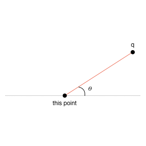
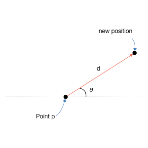
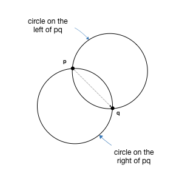
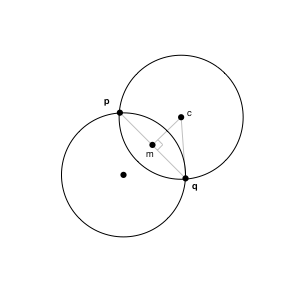

# Lab 0

This is a warm up, ungraded, lab.  

Submission deadline: 2359, Friday, February 2, 2018.

## Learning Objectives

After completing this lab, students should:

- be more comfortable with the CS2030 laboratory environment, including knowing how to remotely access `cs2030-i`, create directory, copy files, edit files, transfer files between `cs2030-i` and local computers, run a script, and other [UNIX commands](unix.md)
- be familiar with compiling and running Java programs from the command line
- be familiar with the concept of standard input and standard output, how to redirect the content of a file to standard input, and how to print to standard output
- be more comfortable with basic Java syntax and semantics, specifically with
    - adding methods into existing classes
		- invoking the methods of the classes to solve problems
		- declaring and using arrays, primitive types, and objects
		- using if/else and for statements
		- printing to standard output
		- the `this` keyword
- experience reading Java API documentation and find out what are the methods available, and what are the arguments and returned types.
- see an example of how class `Scanner` is used
- appreciate how encapsulation of class `Point` and class `Circle` allows one to reason about higher-level tasks without worrying about lower level representation

## Setup

Login to `cs2030-i`, copy the files from `~cs2030/lab0` to your local directory under your home `~/lab0`.  You should see four java files (`Point.java`, `Circle.java`, `MaxDiscCover.java`, and `LabZero.java`), and a few data files (`TESTDATA1.txt`, `TESTDATA2.txt`, ..., `TESTDATA5.txt`)

Read through the files above.  Although we have seen `Circle` and `Point` as examples in class, these classes are slightly different.

## 1. Augment the class Point

Augment the class `Point` with the following public methods and constructors.
You may find the static methods provided by [`java.lang.Math`](https://docs.oracle.com/javase/8/docs/api/java/lang/Math.html) useful.

### 1.1. Static Method to construct mid point
```Java
public static Point midPoint(Point p, Point q)
```

Given two points `p` and `q`, create and return the midpoint of `p` and `q`.

### 1.2 Distance between points
```Java
public double distanceTo(Point q) 
```

You should have written something like this from your Exercise 1.  This method returns the Euclidean distance of `this` point to the point `q`.

### 1.3 Angle between points
```Java
public double angleTo(Point q) 
```

This method returns the angle between the current point and point `q`.  In the figure below, it returns the angle $\theta$.  You can compute this using the `atan2()` function. For instance, 
```Java
Point p = new Point(0, 0);
p.angleTo(new Point(1, 1));
```
should return
```
0.7853981633974483
```
which is $\pi/4$.

```
p.angleTo(new Point(1, 0));
```

should return 

```
0.0
```

`atan2()` takes in two `double` as arguments for coordinate `x` and `y`. It returns `theta`, the angle in radian, counted in 
anti-clockwise direction with respect to origin. One mathematical trick here is if you subtract the coordinates 
of `Point p` from `Point q`, you basically reduce `Point p` to be an origin to `Point q`. 
For more detail, please refer to the Java API for [`atan2`](https://docs.oracle.com/javase/8/docs/api/java/lang/Math.html#atan2-double-double-) for more details.




### 1.4. Move a point 
```Java
public void move(double theta, double d)
```

Move the point by a given distance at direction theta (in radian).  See Figure:



The new point should have the coordinate ($x + d\cos\theta, y + d\sin\theta$).  Note in this method, you are given the angle (theta) and want to find length. Hence you need to use cosine and sine.

After
```
p.move(p.angleTo(q), p.distanceTo(q));
```
`p` should coincide with `q`.

!!! note "Mutable vs. Immutable"
    The method `move` is called a _mutable_ method, since it modifies (mutates) the object that it is called on.  Later in CS2030, you will be introduced to the concept of _immutable_ methods.
    
## 2. Augment the class Circle

Augment the class `Circle` with the following methods and constructors:

### 2.1 Constructor
```Java
public Circle(Point p, Point q, double radius)
```

The constructor above takes in two points `p` and `q`, and returns a circle  that passes through both `p` and `q`, with radius `radius`.  

There are two such possible circles (see figures below) if distance between `p` and `q` is no greater than 2x`radius`[^1].  Imagine if you walk from `p` to `q`, one of the circle will have the center on your left, the other will have the center on your right. In this method, we will only consider the circle on the left because the circle on the right will be considered when you walk from `q` to `p`. See figure below.



Hint: To find the center $c$ of the new circle, you can first find the midpoint $m$ of line $pq$, the length of line $mc$, and the angle between $m$ and $c$, using the `Point` methods you have written.  We also know that length of $cq$ is `radius`.  See figure below.



The constructor should return a `Circle` with [Double.NaN](https://docs.oracle.com/javase/8/docs/api/java/lang/Double.html#NaN) as the radius and (0,0) as center if the distance between `p` and `q` is larger than 2x`radius` or is zero[^2].  Such `Circle` objects are invalid, and you may want to add a method in the `Circle` class to check for validity.  You can use [`Double.isNaN`](https://docs.oracle.com/javase/8/docs/api/java/lang/Double.html#isNaN-double-) for check if a double variable is NaN.

[^1]: If the distance between `p` and `q` is exactly 2x`radius`, then the two circles are one and the same.

[^2]: A cleaner solution is to throw an exception, but you won't learn this until later in class.


## 3. Maximum Disc Coverage

We are now going to use the `Circle` class and `Point` class to solve the maximum disc coverage problem.  In this problem, we are given a set of points on a 2D plane, and a unit disc (i.e., a circle of radius 1).  We want to place the disc so that it covers as many points as possible.  What is the maximum number of points that we can cover with the disc at any one time?   

We will use the following simple (non-optimal)  algorithm[^3].  First, some observations:

- A disc that covers the maximum number of points must pass through at least two points.
- For every pair of points that is of no more than distance 2 away from each other, there is at most two unit discs that have their perimeter passing through the two points (you have written a constructor that helps you to find such circles).

So, the algorithm simply goes through every pair of points, and for each circle that passes through them, count how many points are covered by each circle.

[^3]: This is a $O(n^3)$ algorithm.  Faster algorithm exists.

The skeleton of the main class, called `LabZero.java` has been given to you.  The file `MaxDiscCover.java`, also given, is where you will implement tha maximum disc coverage solution .  These two files are placed in the same directory as `Circle.java` and `Point.java`.  

The skeleton code reads a set of points from the standard input, in the following format:

- The first line is an integer, indicating the number of points $n$ ($n$ > 2) in the file.
- The next $n$ lines contains the $x$ and $y$ coordinates of $n$ points, one point per line.  Each line has two doubles, separated by space.  The first double is the $x$ coordinate; the second double is the $y$ coordinate.

You can assume that the format of the input is always correct and there is always at least two points with distance less than 2 between them.

Complete the program by implementing the maximum disc coverage algorithm above, and print the maximum number of points covered to standard output.  You can add additional methods and fields for `Point` and `Circle` if needed.

```
ooiwt@cs2030-i:~/lab0[xxx]$ java LabZero < TESTDATA1.txt
2
```

The test cases and answers should be:

TEST | Max Number of Points |
-----|----------------------|
1    | 2  |
2    | 4  |
3	 | 12 |
4    | 44 |
5    | 5  |

Note that it is still possible for your solution to be buggy and you still get the same answer as above.

## Adding Methods

You can add new methods as needed into the provided skeleton classes.  You should, however, avoid using setters and getters, and must not break the abstraction barrier by exposing any instance field as `public`.

## Submission

When you are ready to submit your lab, on `cs2030-i`, run the script
```
~cs2030/submit0
```

which will copy your the three java files `MaxDiscCover.java`, `Point.java`, and `Circle.java` (and nothing else) from your `~/lab0` directory on `cs2030-i` to an internal grading directory.

You can submit multiple times, but only the most recent submission will be graded for the next lab onwards. This lab is a warm-up lab, which will not be graded. 
