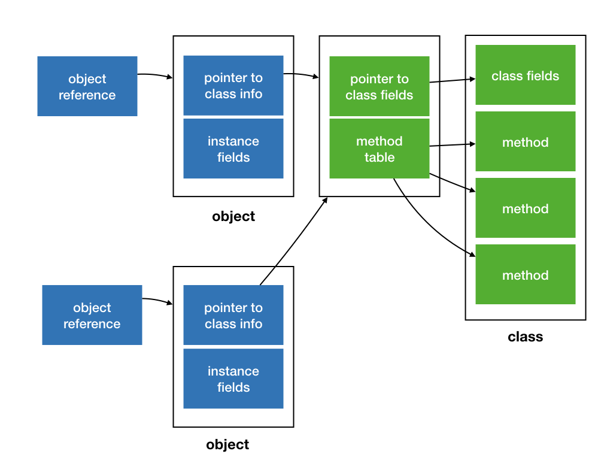
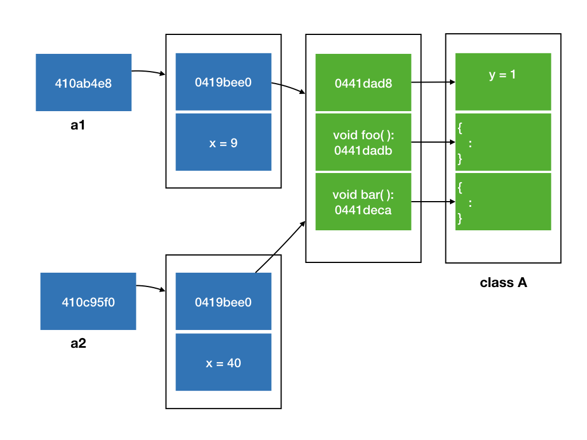
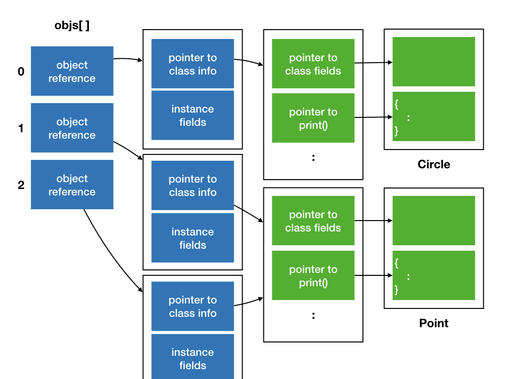
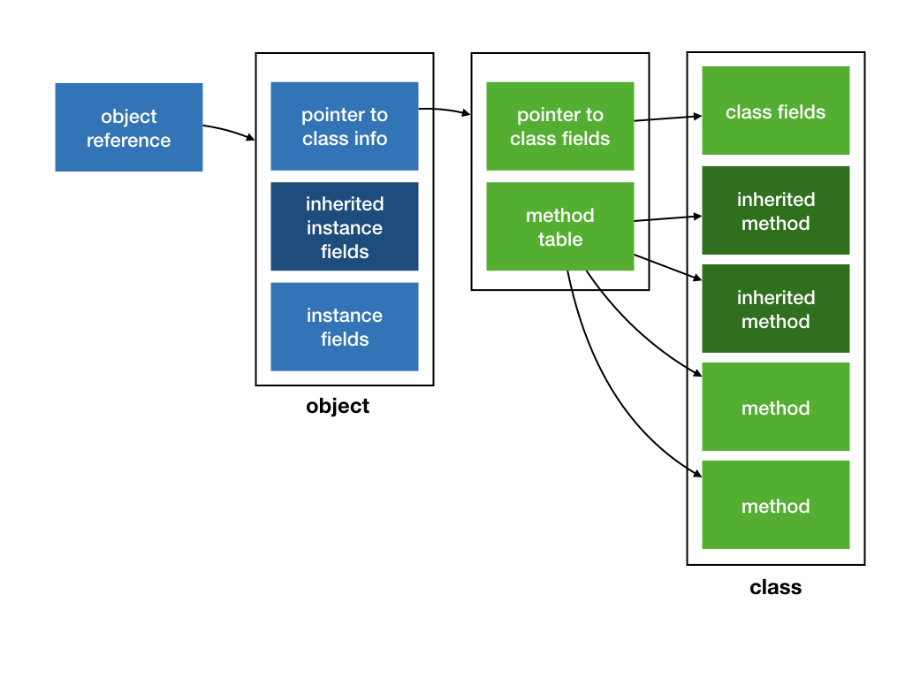

# Lecture 2: Inheritance & Polymorphism

## Learning Objectives

After this lecture, students should:

- be able to build a mental model for how objects and classes are represented in Java
- understand the concepts of object-oriented programming, including interface, polymorphism, late binding, inheritance, method overriding and method overloading, and the usage of these concepts in programming.
- know the purpose and usage of Java keywords `implements`, `extends`, `super`, `instanceof`, and `@Override`
- understand Java concepts of arrays, enhanced `for` loop, method signature, `Object` class, and object equality. 

## Memory Model for Objects

To help understand how classes and objects work, it is useful to visualize how they are stored in the memory.  We mentioned last week that data (e.g., fields) and code (e.g., methods) are stored in two different regions in the memory.  Since an object contains both fields and methods, where do we keep an object?

It turned out that different implementations of Java may store the objects differently, but here is one way that we will follow for CS2030:



In the figure above, there are two objects of the same class.  An object is referred to through its reference, which is a pointer to the memory location where the instance fields for the object is stored, along with a pointer to a _method table_.  A method table stores a table of pointers to the methods, along with a table to the class fields.    

As an example, consider the following class:

```Java
class A {
  private int x;
  static public int y;

  void foo() {
	:
  }

  void bar() {
	:
  }

    :
}
```

If we have two instances of A, `a1` and `a2`, with `A.y = 1`, `a1.x = 9`, `a2.x = 40`, then the memory layout looks like:



Note that, we have only one copy of the `static` class field `y`, regardless of how many instances of `A` we create.

## Enforcing Abstraction Barrier with Interface

Recall the concept of encapsulation. When we develop a large piece of software, it is important to hide the details on data representation and implementation, and only expose certain `public` methods for the users to use.  We can imagine that there is an abstraction barrier between the code that implements the internals of a class (called the _implementer_) and the code that uses the class (called the _client_) to achieve a higher level task.

We have seen that we use `private` to enforce data hiding -- to hide certain fields and methods from outside of the barrier.  Now, we are going to see how we can enforce that the right set of methods are defined, implemented, and used on both sides of the barrier.

The mechanism to do this is through defining an _interface_ (aka a _protocol_ as it is called in Objective-C or Swift).  An interface is like a contract between the implementer of a class and the client of a class.  If a class promises to implement an interface, then we are guaranteed that the methods defined in the interface are already implemented in the class.  Otherwise, the code would not compile.

In Java, we can define an interface using `interface` keyword:

```Java
interface Shape {
	public double getArea();
	public double getPerimeter();
	public boolean contains(Point p);
}
```

The example interface `Shape` above contains only the declaration of the methods, not the implementation.  

Now, let's see how the implementer would implement a class using the interface.

```Java
import java.lang.Math;

class Circle implements Shape {
  private Point center;
  private double radius;

  public Circle(Point initCenter, double initR) {
    center = initCenter;
    radius = initR;
  }

  public void moveTo(Point p) {
    center = p;
  }

  @Override
  public double getArea() {
    return Math.PI * radius * radius;
  }

  @Override
  public boolean contains(Point p) {
    return (p.distance(center) < radius);
  }

  @Override
  public double getPerimeter() {
    return Math.PI * 2 * radius;
  }
}
```

This is very similar to the code you saw in Lecture 1, except that in Line 2, we say `class Circle implements Shape`.  This line informs the compiler that the programmer intends to implement all the methods included in the interface `Shape` exactly as declared (in terms of names, the number of arguments, the types of arguments, returned type, and access modifier).  The rest of the class is the same, except that we renamed `getCircumference` with `getPerimeter`, which is more general and applies to all shapes.  We also added _annotations_ to our code by adding the line `@Override` before methods in `Circle` that implement the methods declared in `Shape`.  This annotation is optional, but it informs the compiler of our intention and helps make the intention of the programmer clearer to others who read the code.

!!! note "Java Annotation"
    Annotations are metadata that is not part of the code.  They do not affect execution.  They are useful to compilers and other software tools, as well as humans who read the code.  While we can similarly make the code more human-friendly with comments, an annotation is structured and so can be easily parsed by software.  You will see 1-2 more useful annotations in this module.

Note that we can have other methods (such as `moveTo`) in the class beyond what is promised in the interface the class implements.

_A class can implement more than one interface._  For instance, let's say that we have another interface called `Printable`[^1] with a single method defined:

```
interface Printable {
	public void print();
}
```

The implementer of `Circle` wants to inform the clients that the method `void print()` is implemented, it can do the following:

```Java
class Circle implements Shape, Printable {
	 :
	 :
	 @Override
	 public void print() {
		 System.out.printf("radius: %f\n", radius);
		 System.out.printf("center:");
		 center.print();
	 }
}
```

In the above, we call `print()` on the `Point` object as well.  How do we know that `Point` provides a `print()` method?  Well, we can read the implementation code of `Point`, or we can agree with the implementer of `Point` that `Point` provides a `Printable` interface!  

It is important to note that, `interface` provides a _syntactic_ contract on the abstraction barrier, but it does not provide a _semantic_ contract.  It does not, for instance, guarantee that `print()` actually prints something to the screen.  One could still implement interface `Printable` as follows:

```Java
class Circle implements Shape, Printable {
	 :
	 :
	 @Override
	 public void print() {
	 }
}
```

and the code still compiles!

Not all programming languages that support classes support interface.  C++, Javascript, and Python, for instance, do not support similar concepts.

!!! note "Default Access Modifier for Interface"
    In the examples above, I explicitly specify the methods in the `Printable` and `Shape` interfaces as `public`.  In Java, all methods in an interface are public by default, so the keywords `public` could be omitted.

## Interface as Type

In Java, an interface is a type.  What this means is that:

- We can declare a variable with an interface type, such as:
```Java
	Shape circle;
```
or
```Java
	Printable circle;
```
We cannot, however, instantiate an object from an interface
since an interface is a "template", an "abstraction", and does not have an implementation.  For instance:

```Java
	// this is not OK
	Printable p = new Printable();
	// this is OK
	Printable circle = new Circle(new Point(0, 0), 10);
```

- Similarly, we can pass arguments of an interface type into a method, and the return type of a method can be an interface.

- An object can be an instance of multiple types.  Recall that Java is a statically typed language. We associate a type with a variable.  We can assign a variable to an object if the object is an instance of the type of the variable.  For example, Line 4 above creates a new circle, which is an instance of three types: `Circle`, `Shape`, and `Printable`.  It is ok to assign this new circle to a variable of type `Printable`.

We say that `Shape` and `Printable` are _supertypes_ of `Circle`, and `Circle` is a subtype of `Shape` and `Printable`.

## Late Binding and Polymorphism

We can now do something cool like this:
```Java
	Printable[] objs;
	  :
	  // initialize array objs
    :
	for (Printable o: objs) {
		o.print();
	}
```

Let's examine this code.  Line 1 declares an array of objects of type `Printable`.  We skip over the code to initialize the content of the array for now, and
jump to Line 5-7, which is a `for` loop.  Line 5 declares a loop variable `o` of type `Printable` and loops through all objects in the array `objs`, and Line 6 invokes the method `print` of `o`.

!!! note "Array and For Loops in Java"
	See Oracle's tutorial on [array](https://docs.oracle.com/javase/tutorial/java/nutsandbolts/arrays.html) and [enhanced loop](h]ttps://docs.oracle.com/javase/tutorial/java/nutsandbolts/for.html)

The magic happens in Line 6:

- First, since we know that any object in the array has the type `Printable`, this means that they must implement the `Printable` interface and support the method `print()`.  
- Second, we do not know, and we do not _need_ to know which class an object is an instance of.
- Third, we can actually have objects of completely unrelated classes in the same array. We can have objects of type `Circle`, and objects of type `Point`.  We can have objects of type `Factory`, or objects of type `Student`, or objects of type `Cushion`.  As long as the objects implement the `Printable` interface, we can put them into the same array.
- Fourth, at _run time_, Java looks at the object `o`, and determines its class, and invokes the right implementation of `print()` corresponding to the `o`.  That is, if `o` is an instance of a class `Circle`, then it will call `print()` method of `Circle`; if `o` is an instance of a class `Point`, then it will call `print()` method of `Point`, and so on.

To further appreciate the magic in Line 6, especially on last point above, consider how a function call is done in C.  In C, you cannot have two functions of the same name within the same scope, so if you call a function `print()`, you know exactly which set of instructions will be called[^2].  So, the name `print` is bound to the corresponding set of instructions at compilation time.  This is called _static binding_ or _early binding_.
To have `print()` for different types, we need to name them differently to avoid naming conflicts: e.g., `print_point()`, `print_circle()`.

[^2]: Remember a function is just an abstraction over a set of instructions.

In a language with static binding, suppose you want to mix objects of different types
together in an array, you need to do something like the following pseudocode:
```C
   for each object in the array
	   if object is a point
		   print_point(object)
	   else if object is a circle
		   print_circle(object)
     else if object is a square
		   print_square(object)
		   :
		   :
```

Not only is the code verbose and ugly, it would be cumbersome if you define a new compound data type that supports printing, since you would need to remember to add a new if-else condition to call for a corresponding print function.

In OO languages, you can have methods named `print()` implemented differently in different classes.  When we compile the code above, the compiler will have no way to know which implementation will be called.  The bindings of `print()` to the actual set of instructions will only be done at run time, after the object `o` is instantiated from a class.  This is known as _dynamic binding_, or _late binding_, or _dynamic dispatch_.



If you understand how an object is represented internally, this is not so magical after all.  Referring to the figure above, the array `objs[]` contains an array of references to objects, the first one is a `Circle` object, and the following two are `Point` objects.  When `o.print()` is invoked, Java refers to the method table, which points to either the method table for `Circle` or for `Point`, based on the class the object is an instance of.

This behavior, which is common to OO programming languages, is known as _polymorphism_[^3].

[^3]: In biology, polymorphism means that an organism can have many different forms.

## The Abstraction Principle

With the interface `Shape`, we can implement other classes, such as `Rectangle`, `Square`, `Polygon` with the same interface.  For instance,

```Java
class Rectangle implements Shape, Printable {
		 // left as exercise (See Exercise 2)
}
```

So far, we have been treating our shapes as pure geometric objects.  Let's consider an application where we want to paint the shapes.  Each shape should have a fill color and a border (with color and thickness).

```Java
import java.awt.Color;
    :

class PaintedCircle implements Shape, Printable {
  private Color  fillColor;
	private Color  borderColor;
	private double borderThickness;

	public void fillWith(Color c) {
		fillColor = c;
	}

	public void setBorderThickness(double t) {
		borderThickness = t;
	}

	public void setBorderColor(Color c) {
		borderColor = c;
	}

	// other methods and fields for Circle from before

}
```

In the code above, we added the line `import java.awt.Color` to use the [Color class](https://docs.oracle.com/javase/8/docs/api/java/awt/Color.html) that Java provides, and added three private members as well as their setters.

We can do the same for `Triangle`

```Java
import java.awt.Color;
    :

class PaintedTriangle implements Shape, Printable {
  private Color  fillColor;
	private Color  borderColor;
	private double borderThickness;

	public void fillWith(Color c) {
		fillColor = c;
	}

	public void setBorderThickness(double t) {
		borderThickness = t;
	}

	public void setBorderColor(Color c) {
		borderColor = c;
	}

	// other methods and fields written for Triangle

}
```

and for other shapes.

Great!  We now have colorful shapes.  The code above, however, is not _good_ code, even though it is _correct_.  Just consider what needs to be done if we decide to support border styles (dotted border, solid border, dashed border, etc).  We would have to edit every single class that supports colors and borders!

One principle that we can follow is the _abstraction principle_, which says "Each significant piece of functionality in a program should be implemented in just one place in the source code. Where similar functions are carried out by distinct pieces of code, it is generally beneficial to combine them into one by abstracting out the varying parts."[^4]

[^4]: This principle is formulated by Benjamin C. Pierce in his book _Types and Programming Languages_.

Following the principle, we want to implement these style-related fields and methods in just one place.  But where?

## Inheritance

The OO-way to do this is to create a _parent class_, and put all common fields and methods into the parent.  A parent class is defined just like a normal class.  For instance:

```Java
class PaintedShape {
  private Color  fillColor;
	private Color  borderColor;
	private double borderThickness;

  public PaintedShape(Color initFillColor, Color initBorderColor, double initBorderThickness) {
		fillColor = initFillColor;
		borderColor = initBorderColor;
		borderThickness = initBorderThickness;
	}

	public void fillWith(Color c) {
		fillColor = c;
	}

	public void setBorderThickness(double t) {
		borderThickness = t;
	}

	public void setBorderColor(Color c) {
		borderColor = c;
	}
}
```

The `PaintedCircle` class, `PaintedSquare` class, etc, can now _inherits_ non-private fields and methods from the parent class, using the `extends` keyword.  
```Java

class PaintedCircle extends PaintedShape implements Shape, Printable {
	  :
}

class PaintedSquare extends PaintedShape implements Shape, Printable {
	  :
}
```

This mechanism for a class to inherit the properties and behavior from a parent is called _inheritance_, and is the fourth and final basic OO principles we cover[^5].

[^5]: The other three is encapsulation, abstraction, and polymorphism.

With inheritance, we do not have to repeat the declaration of fields `fillColor`, `borderColor`, `borderThickness` and the associated methods in them.  This software engineering principle is also known as the DRY principle -- "_don't repeat yourself_" principle.  We are going to see DRY very regularly in future lectures.

We also call the `PaintedShape` the superclass (or base class) of `PaintedCircle` and `PaintedSquare`, and call `PaintedCircle` and `PaintedSquare` the subclass (or derived class)[^6] of `PaintedShape`.

[^6]: Again, you see that computer scientist can be quite indecisive when it comes to the terminologies in OOP.

A `PaintedCircle` object can now call `fillWith()` even if the method `fillWith()` is not defined in `PaintedCircle` -- it is defined in `PaintedCircle`'s parent `PaintedShape`.  

When a class extends a parent class, it inherits all the non-private fields and methods, so we can depict the objects and the class as follows:



The method table now includes pointers to methods defined in the parent (and grandparents, and so on).

## Overloading

Now consider the constructor for `PaintedCircle`.   We need to initialize the geometric shape as well as the painting style.  But, we define the fields `fillColor`, etc `private`, and thus subclasses have no access to `private` fields in the parent.  We need to call the constructor of the parent to initialize these private fields.  The way to do this is to use the `super` keyword, as such:

```Java
  public PaintedCircle(Point initCenter, double initRadius, Color initFillColor, Color initBorderColor, double initBorderThickness) {
		super(initFillColor, initBorderColor, initBorderThickness);
		c = initCenter;
		r = initRadius;
	}
```

You can see that the constructor for `PaintedCircle` now takes in five parameters.  You can imagine that as the class gets more sophisticated with more fields, we need to pass in more parameters to the class to initialize the fields.  It is not uncommon to provide alternative constructors with fewer parameters and assign some _default_ values to the fields.

```Java
  // create circle with default style (white with black border of thickness 1)
  public PaintedCircle(Point initCenter, double initRadius) {
	  super(Color.WHITE, Color.BLACK, 1.0);
	  c = initCenter;
	  r = initRadius;
  }

	// create circle with customized styles  
  public PaintedCircle(Point initCenter, double initRadius, Color initFillColor, Color initBorderColor, double initBorderThickness) {
		super(initFillColor, initBorderColor, initBorderThickness);
		c = initCenter;
		r = initRadius;
	}
```

Two methods in a class can have the same name and still co-exist peacefully together.  This is called _overloading_.  When a method is called, we look at the _signature_ of the method, which consists of (i) the name of the method, (ii) the number, order, and type of the arguments, to determine which method is called.  To be precise, the first sentence of this paragraph should read: Two methods in a class can have the same name and still co-exist peacefully together, as long as they have different signatures.  Note that the return type is not part of the method signature, so you cannot have two methods with the same name and same arguments but different return type.  

Even though the example above shows overloading of the constructor, we can overload other methods as well.  

## Exercise

1. Write another class `Rectangle` that implements these two interfaces.  You should make use of the class `Point` that you implemented from Lecture 1's exercise.  Then write another class `PaintedRectangle` that implements the two interfaces and inherits from `PaintedShape` that implements the two interfaces and inherits from `PaintedShape`.  You can assume that the sides of the rectangles are parallel with the x- and y-axes (in other words, the sides are either horizontal or vertical).

